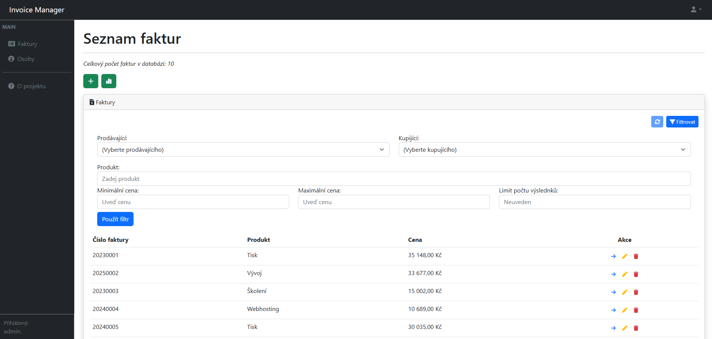
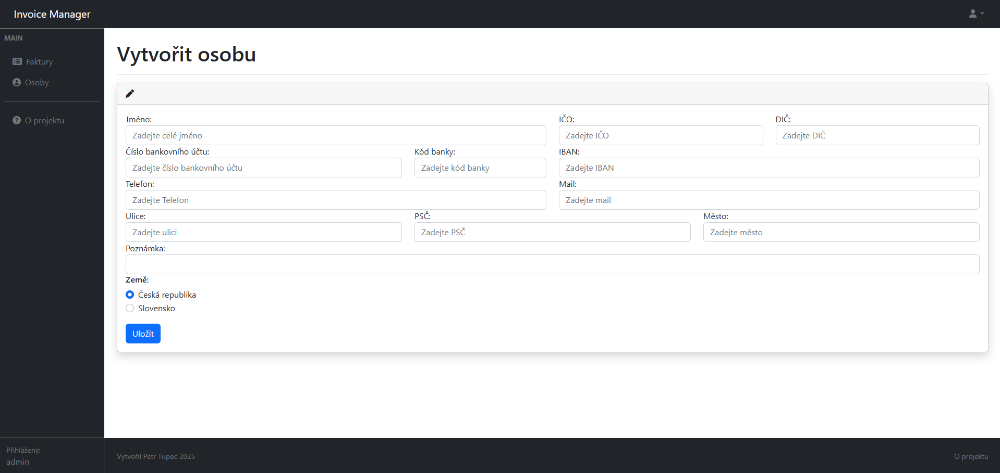
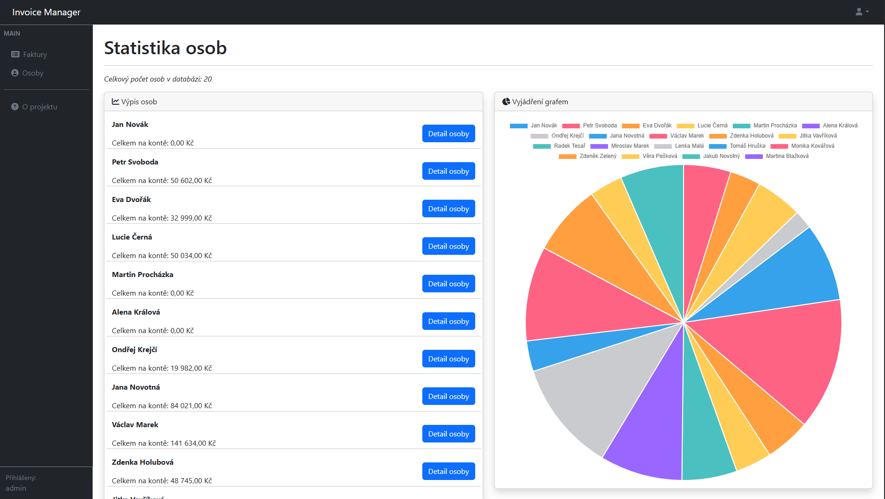
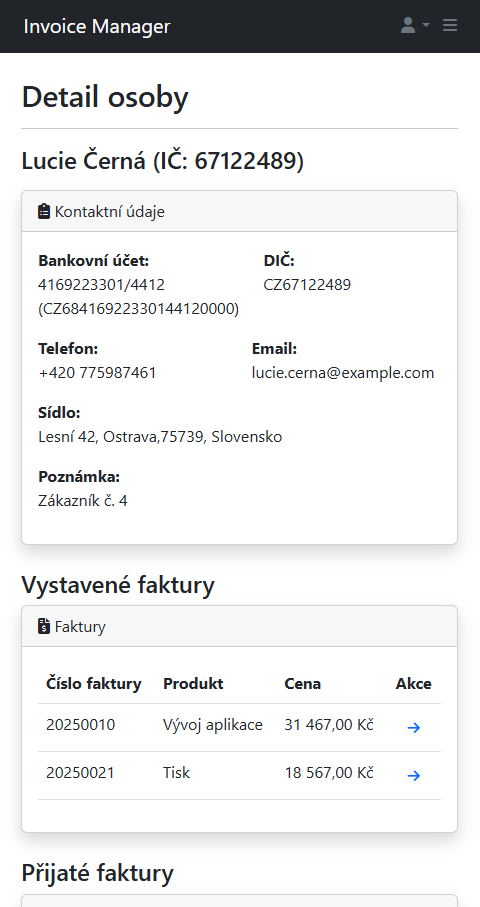
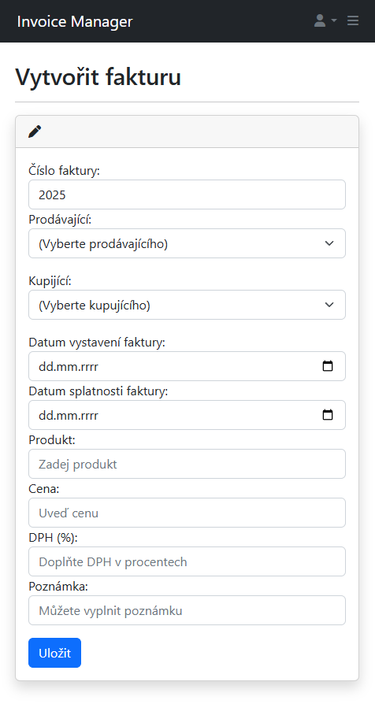

# Fakturační systém

## O projektu

Tento projekt je webová aplikace pro správu faktur a osob s možností zobrazení základních statistik. Projekt je momentálně soukromý, ale na vyžádání lze udělit přístup k repozitáři.

### Motivace projektu

Projekt byl vytvořený za účelem procvičení CRUD operací, propojení frontendové a backendové části s databází a osvojení si základních principů vývoje webových aplikací.

## Funkcionalita

### Práce s fakturami

- Implementace CRUD operací (vytvoření, čtení, úpravy, mazání).
- Zobrazení a úprava detailů faktur na základě specifických parametrů.

### Práce s osobami

- Implementace CRUD operací (vytvoření, čtení, úpravy, mazání).
- Možnost propojení osob s fakturami pro zajištění správného přiřazení a filtrování.

### Statistiky

- Generování a zobrazení základních statistik na základě dat o fakturách a osobách.

## Použité technologie

### Client

- JavaScript
- React
- React Router
- HTML/CSS
- Bootstrap
- Postman (testování API)

### Server

- Java
- Spring Boot
- Swagger (API dokumentace)
- JPA (Hibernate)
- Lombok
- Mapstruct
- Jakarta Bean Validation
- MySQL
- phpMyAdmin

## Ukázka UI

#### Seznam faktur s filtrací



#### Formulář přidání osoby



#### Základní statiskika osob s grafem



#### Mobilní zobrazení detailu osoby



#### Mobilní zobrazení formuláře pro přidání faktury



## Ukázka kódu - InvoiceService

V této ukázce se podíváme na metodu `getAll`, která je součástí služby pro správu faktur. Tato metoda umožňuje získat seznam faktur na základě filtrů a stránkování.

#### Definice metody v Interface
```java
    /**
    * Retrieves a paginated list of invoices matching the specified filter criteria.
    *
    * @param page the page number to retrieve (zero-based index)
    * @param invoiceFilter the filter criteria to apply when retrieving invoices
    * @return a page of {@link InvoiceDTO} objects that match the filter
    */
    Page<InvoiceDTO> getAll(int page, InvoiceFilter invoiceFilter);
```
#### Implementace metody
```Java
   @Override
    public Page<InvoiceDTO> getAll(int page, InvoiceFilter invoiceFilter) {
        InvoiceSpecification invoiceSpecification = new InvoiceSpecification(invoiceFilter);
        PageRequest pageRequest = PageRequest.of(page, invoiceFilter.getLimit());
        Page<InvoiceEntity> invoiceEntities = invoiceRepository.findAll(invoiceSpecification, pageRequest);
        List<InvoiceDTO> invoiceDTOs = invoiceMapper.toDTOList(invoiceEntities.getContent());
        return new PageImpl<>(invoiceDTOs, pageRequest, invoiceEntities.getTotalElements());
    }
```

## Možná vylepšení

- Implementace uživatelské autentizace (Spring Security + JWT)
- Možnost exportu faktur do PDF

## Spuštění projektu lokálně

### 1. Získejte přístup

Požádejte mě o přístup do následujících soukromých repozitářů:
- [`invoice-client-starter`](https://github.com/PetrTupec/invoice-client-starter)
- [`invoice-server-starter`](https://github.com/PetrTupec/invoice-server-starter)

### 2. Naklonujte hlavní repozitář se submoduly

```bash
git clone --recurse-submodules https://github.com/PetrTupec/invoice-project.git
cd invoice-project
```

Pro dopnění samotných submodulů do hlavního repozitáře použijte:

```bash
git submodule update --init --recursive
```

### 3. Spusťte aplikaci v Dockeru

```bash
docker-compose up --build
```

Po spuštění bude aplikace dostupná:

- Frontend: http://localhost
- Backend API: http://localhost:8080

## Přístup ke kódu

Tento repozitář slouží pouze pro účely prezentace projektu. Zdrojový kód je v soukromém repozitáři a přístup lze poskytnout na vyžádání.
