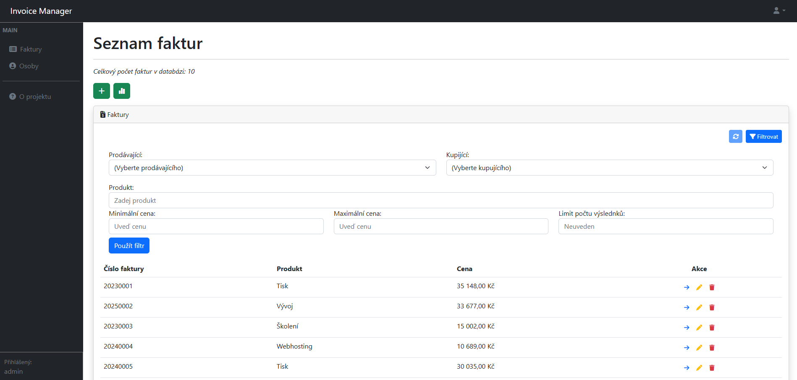
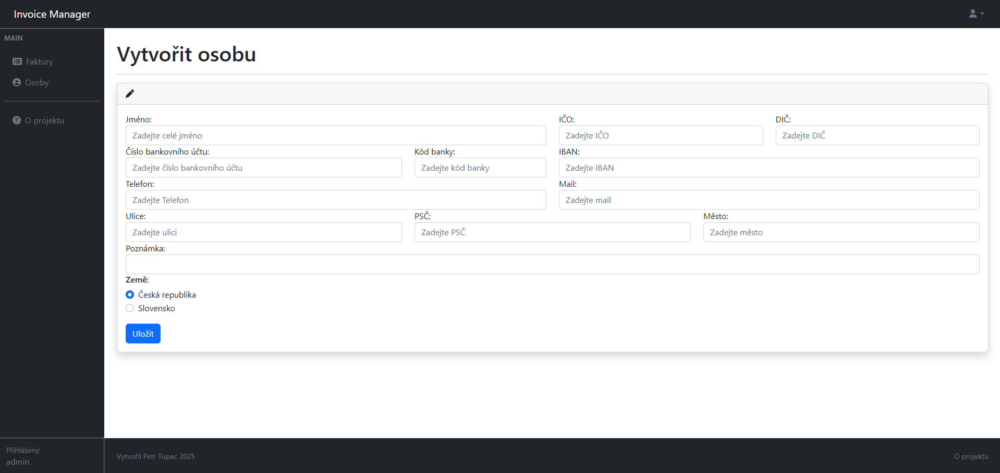
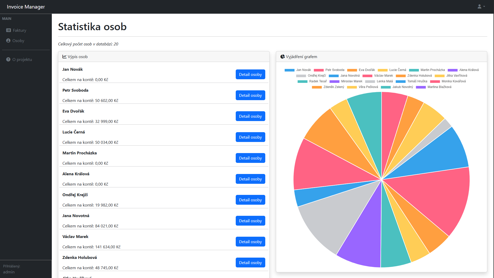
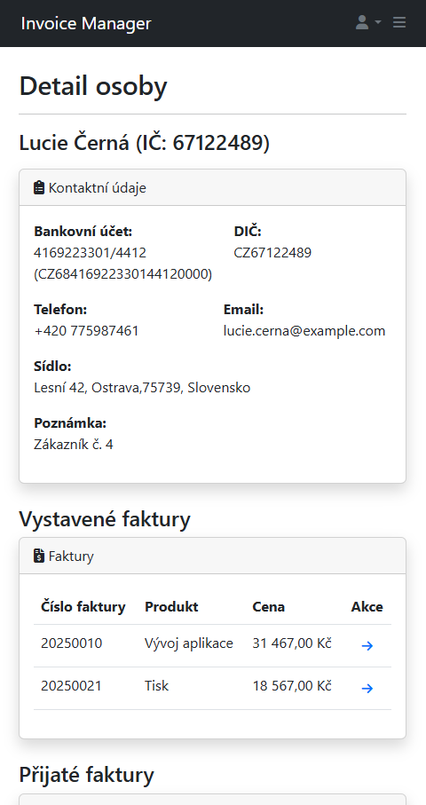
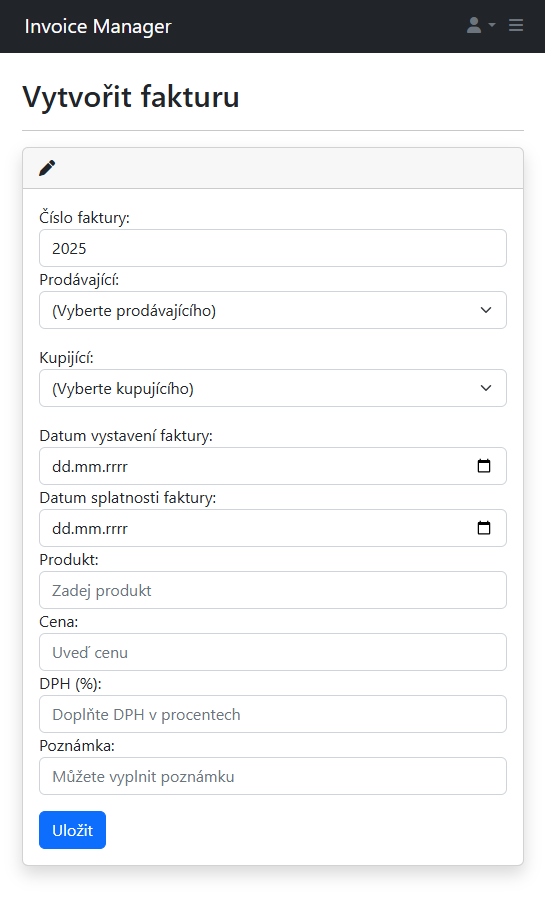

# Fakturační systém

## O projektu

Tento projekt je webová aplikace pro správu faktur a osob s možností zobrazení základních statistik. Projekt je momentálně soukromý, ale na vyžádání lze udělit přístup k repozitáři.

### Motivace projektu

Projekt byl vytvořený za účelem procvičení CRUD operací, propojení frontendové a backendové části s databází a osvojení si základních principů vývoje webových aplikací.

## Funkcionalita

### Práce s fakturami

- Implementace CRUD operací (vytvoření, čtení, úpravy, mazání).
- Zobrazení a úprava detailů faktur na základě specifických parametrů.

### Práce s osobami

- Implementace CRUD operací (vytvoření, čtení, úpravy, mazání).
- Možnost propojení osob s fakturami pro zajištění správného přiřazení a filtrování.

### Statistiky

- Generování a zobrazení základních statistik na základě dat o fakturách a osobách.

## Použité technologie

### Client

- JavaScript
- React
- React Router
- HTML/CSS
- Bootstrap
- Postman (testování API)

### Server

- Java
- Spring Boot
- Swagger (API dokumentace)
- JPA (Hibernate)
- Lombok
- Mapstruct
- Jakarta Bean Validation
- MySQL
- phpMyAdmin

## Ukázka UI

#### Seznam faktur s filtrací



#### Formulář přidání osoby



#### Základní statiskika osob s grafem



#### Mobilní zobrazení detailu osoby



#### Mobilní zobrazení formuláře pro přidání faktury



## Ukázka kódu - InvoiceService

V této ukázce se podíváme na metodu `getAll`, která je součástí služby pro správu faktur. Tato metoda umožňuje získat seznam faktur na základě filtrů a stránkování.

#### Definice metody v Interface
```java
/**
 * Získá seznam faktur na základě daných filtrů a čísla stránky.
 *
 * @param page            Číslo stránky pro stránkování.
 * @param invoiceFilter   Filtrační parametry pro výběr faktur.
 * @return Seznam faktur převedených na DTO.
 */
List<InvoiceDTO> getAll(int page, InvoiceFilter invoiceFilter);
```
#### Implementace metody
```Java
  @Override
    public List<InvoiceDTO> getAll(int page, InvoiceFilter invoiceFilter) {
        InvoiceSpecification invoiceSpecification = new InvoiceSpecification(invoiceFilter);
        PageRequest pageRequest = PageRequest.of(page, invoiceFilter.getLimit());
        List<InvoiceEntity> invoices = invoiceRepository.findAll(invoiceSpecification, pageRequest)
                .getContent();
        return invoiceMapper.toDTOList(invoices);
    }
```

## Možná vylepšení

- Implementace uživatelské autentizace (Spring Security + JWT)
- Možnost exportu faktur do PDF

## Přístup ke kódu

Tento repozitář slouží pouze pro účely prezentace projektu. Zdrojový kód je v soukromém repozitáři a přístup lze poskytnout na vyžádání.
